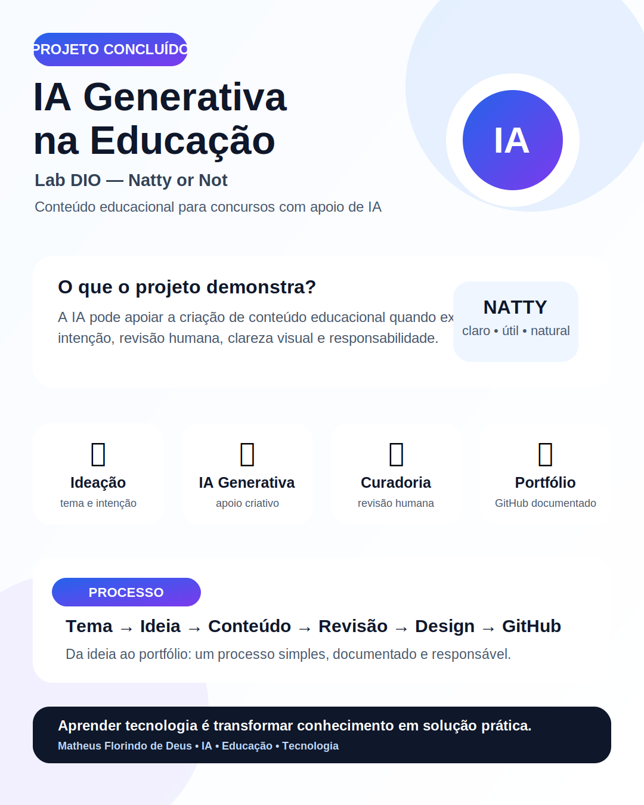

<div align="center">

# IA aplicada à criação de conteúdo educacional para concursos

### Lab DIO — Natty or Not | Conteúdo educacional com IA Generativa


**Projeto autoral desenvolvido para explorar como ferramentas de IA Generativa podem apoiar a criação de conteúdo educacional claro, útil e visualmente atrativo.**

</div>

---

## Preview do projeto


## Arte premium complementar



---

## Visão geral

Este repositório foi desenvolvido como entrega do desafio **Lab DIO — Natty or Not**, com o objetivo de demonstrar o uso de **Inteligência Artificial Generativa** na criação de conteúdo educacional voltado para estudantes de concursos.

A proposta central foi usar IA não apenas para gerar texto ou imagem, mas para estruturar uma comunicação mais clara, didática e aplicável, mantendo linguagem natural, utilidade prática e coerência visual.

> O foco do projeto é mostrar o processo de criação, a reflexão sobre o uso de IA e o resultado final como peça de portfólio educacional.

---

## Documentação complementar

| Arquivo | Finalidade |
|---|---|
| [`PROMPTS.md`](PROMPTS.md) | Registra as instruções usadas no processo criativo. |
| [`PROCESSO_CRIATIVO.md`](PROCESSO_CRIATIVO.md) | Explica as etapas de criação, revisão e documentação. |
| [`CRITERIOS_AVALIACAO.md`](CRITERIOS_AVALIACAO.md) | Define os critérios usados para avaliar naturalidade, clareza e utilidade. |
| [`infografico-premium.svg`](infografico-premium.svg) | Arte complementar em formato vertical 1080 x 1350 para apresentação do projeto. |

---

## Problema

Muitos conteúdos educacionais produzidos com IA acabam ficando genéricos, artificiais ou visualmente pouco claros. No contexto de estudantes de concursos, isso pode dificultar o entendimento e reduzir o valor prático do material.

O desafio foi criar um conteúdo que respondesse à pergunta central do Lab:

> **Esse conteúdo parece natural, útil e bem construído ou parece artificial demais?**

---

## Solução proposta

Foi produzido um material digital com apoio de IA Generativa, direcionado à educação e aos estudos para concursos. O conteúdo foi pensado para ser:

- claro;
- visualmente organizado;
- direto;
- útil para estudantes;
- compatível com publicação em portfólio;
- coerente com uma proposta educacional.

A IA foi usada como apoio criativo e estrutural, enquanto a curadoria humana foi responsável por definir intenção, público-alvo, refinamento, revisão e adequação final.

---

## Objetivos do projeto

| Objetivo | Descrição |
|---|---|
| Explorar IA Generativa | Testar o uso de IA no apoio à criação de conteúdo educacional. |
| Produzir material útil | Criar uma peça com comunicação clara para estudantes de concursos. |
| Exercitar curadoria humana | Revisar, ajustar e melhorar o conteúdo gerado por IA. |
| Documentar o processo | Registrar ferramentas, etapas, decisões e aprendizados. |
| Construir portfólio | Apresentar uma entrega organizada, visual e profissional no GitHub. |

---

## Tecnologias e ferramentas utilizadas

| Ferramenta | Uso no projeto |
|---|---|
| ChatGPT | Ideação, estruturação textual, refinamento de linguagem e revisão. |
| Canva | Composição visual e organização do material gráfico. |
| GitHub | Versionamento, documentação e publicação do projeto. |
| Ferramentas de edição de imagem | Ajustes visuais, composição e acabamento final. |
| Markdown | Documentação técnica e apresentação do processo. |
| SVG | Arte complementar versionada no repositório. |

---

## Processo de criação

### 1. Definição do tema

O primeiro passo foi definir um tema com aplicação real: **conteúdo educacional para estudantes de concursos**.

A escolha foi feita por três motivos:

- relevância prática para quem estuda;
- conexão com educação e tecnologia;
- possibilidade de testar se a IA conseguiria gerar um conteúdo útil e natural.

### 2. Estruturação com IA

A IA foi utilizada para organizar ideias, sugerir formatos de apresentação, melhorar clareza textual e transformar informações em uma comunicação mais didática.

### 3. Curadoria humana

Após a geração inicial, o conteúdo passou por revisão humana para evitar excesso de texto, linguagem artificial, informações genéricas e baixa utilidade.

### 4. Construção visual

A parte visual foi organizada em formato de material digital, buscando equilíbrio entre estética, legibilidade e objetivo educacional.

### 5. Documentação no GitHub

O projeto foi organizado em repositório público para registrar o processo, as tecnologias utilizadas, os resultados e a reflexão crítica sobre o uso de IA.

---

## Prompt base utilizado

```text
Crie um conteúdo educacional claro, objetivo e visualmente organizado para estudantes de concursos públicos.

O material deve usar linguagem simples, parecer natural, evitar exageros e ter utilidade prática.

O objetivo é demonstrar como a IA Generativa pode apoiar a criação de conteúdo educacional sem substituir a curadoria humana.

Estruture o conteúdo com título forte, explicação curta, pontos principais, linguagem didática, tom profissional e visual adequado para publicação digital.
```

Mais instruções estão documentadas em [`PROMPTS.md`](PROMPTS.md).

---

## Critérios de avaliação — Natty or Not

| Critério | Pergunta de avaliação | Resultado esperado |
|---|---|---|
| Naturalidade | O conteúdo parece escrito para pessoas reais? | Sim |
| Clareza | A mensagem é fácil de entender? | Sim |
| Utilidade | O material ajuda o público-alvo? | Sim |
| Visual | A composição facilita a leitura? | Sim |
| Ética no uso da IA | A IA foi usada como apoio, não como substituição total da análise humana? | Sim |
| Coerência | O conteúdo combina com o objetivo educacional? | Sim |

A matriz detalhada está em [`CRITERIOS_AVALIACAO.md`](CRITERIOS_AVALIACAO.md).

---

## Resultado entregue

O resultado foi uma peça digital educacional criada com apoio de IA, documentada em repositório público e apresentada como entrega prática do Lab DIO.

O projeto demonstra que ferramentas generativas podem acelerar a criação de conteúdo, desde que exista intenção clara, revisão crítica e responsabilidade no uso.

---

## Reflexão

O principal aprendizado do projeto foi entender que a IA pode ser uma excelente ferramenta de apoio criativo, mas o valor final depende da curadoria humana.

A tecnologia ajuda a gerar ideias, estruturar mensagens e acelerar o processo. Porém, clareza, contexto, bom senso, revisão e responsabilidade continuam sendo indispensáveis.

Em um cenário educacional, o objetivo não deve ser apenas produzir mais rápido, mas produzir melhor: com utilidade, verdade, organização e respeito ao público que vai consumir o conteúdo.

---

## Aprendizados principais

- IA Generativa pode apoiar a criação de conteúdo educacional.
- Bons prompts melhoram muito a qualidade da entrega.
- Curadoria humana é essencial para evitar conteúdo genérico.
- Design e texto precisam trabalhar juntos.
- Um bom projeto de IA deve explicar processo, intenção e limitações.

---

## Melhorias futuras

- [x] Adicionar documentação de prompts.
- [x] Documentar processo criativo.
- [x] Criar critérios de avaliação.
- [x] Adicionar arte premium complementar.
- [ ] Incluir comparação antes/depois do refinamento com IA.
- [ ] Criar uma versão em carrossel para LinkedIn e Instagram.
- [ ] Adicionar critérios avançados de acessibilidade visual.

---

## Checklist da entrega DIO

- [x] Tema definido
- [x] Uso de IA Generativa
- [x] Resultado visual incluído
- [x] Processo de criação documentado
- [x] Tecnologias utilizadas descritas
- [x] Reflexão crítica incluída
- [x] Repositório público no GitHub
- [x] README organizado para portfólio
- [x] Prompts documentados
- [x] Processo criativo documentado
- [x] Critérios de avaliação documentados
- [x] Arte premium complementar adicionada

---

## Referência complementar

- [Base10: If You’re Not First, You’re Last: How AI Becomes Mission Critical](https://base10.vc/post/generative-ai-mission-critical/)


---

## Autor

**Matheus Florindo de Deus**

Policial Militar | Tecnologia | Inteligência Artificial aplicada à educação

- GitHub: [@matheusflorindo32](https://github.com/matheusflorindo32)
- LinkedIn: [Matheus Florindo de Deus](https://www.linkedin.com/in/matheus-florindo-de-deus-b953b017a/)

---

<div align="center">

**Aprender tecnologia é transformar conhecimento em solução prática.**

</div>
